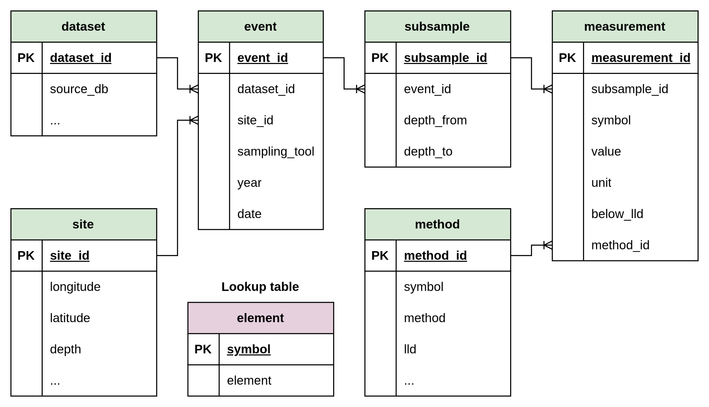

```{css, echo=FALSE}
th {
  white-space: nowrap;
}
```

The page shows the schema diagram and table definitions for the slim database, designed as a common schema that can accommodate multiple data sources.

## DB Schema Diagram

The slim schema contains seven tables. The hierarchy flows from `dataset` and `site` through `event` and `subsample` to `measurement`. The `element` table serves as a lookup for both `method` and `measurement` via the `symbol` key.

{.zoomable}

::: {.callout-warning}
The `symbol` column in `measurement` is an intentional denormalization — it is derivable via `method_id → method.symbol` but is retained as a key for query efficiency.
:::

## Element Table

The element table is a lookup table mapping chemical symbols to element names.

### Table Columns
```{r}
library(tibble)

element_tbl <- tribble(
  ~Name,      ~`Data Type`, ~PK, ~`NA Allowed`, ~Description,
  "symbol",   "TEXT",       "✓", "",            "Primary Key. Chemical symbol (e.g., Co, Cu).",
  "element",  "TEXT",       "",  "",            "Full element name (e.g., Cobalt, Copper)."
)

element_tbl
```

## Dataset Table

The dataset table represents a data collection campaign or source (e.g., Mareano Cruise, Marine Basecamp Cruise).

### Table Columns
```{r}
dataset_tbl <- tribble(
  ~Name,          ~`Data Type`, ~PK, ~`NA Allowed`, ~Description,
  "dataset_id",   "INTEGER",    "✓", "",            "Primary Key. Unique dataset identifier.",
  "source",       "TEXT",       "",  "",            "Name of the source database (e.g., Mareano).",
  "country",      "TEXT",       "",  "",            "Country of origin.",
  "institute",    "TEXT",       "",  "",            "Institute responsible for data collection.",
  "dataset_name", "TEXT",       "",  "",            "Name of the data collection campaign."
)

dataset_tbl
```

## Site Table

The site table stores unique geographic locations, keyed on latitude and longitude rounded to two decimal places, and depth.

### Table Columns
```{r}
site_tbl <- tribble(
  ~Name,           ~`Data Type`, ~PK, ~`NA Allowed`, ~Description,
  "site_id",       "INTEGER",    "✓", "",            "Primary Key. Unique site identifier.",
  "latitude",      "REAL",       "",  "",            "Latitude in decimal degrees (rounded to 2 d.p.).",
  "longitude",     "REAL",       "",  "",            "Longitude in decimal degrees (rounded to 2 d.p.).",
  "depth",         "REAL",       "",  "✓",           "Water depth in meters (positive downward).",
  "country",       "TEXT",       "",  "✓",           "Nearest country.",
  "country_code",  "TEXT",       "",  "✓",           "ISO country code.",
  "dist_to_coast", "INTEGER",    "",  "✓",           "Distance to nearest coastline (km).",
  "municipality",  "TEXT",       "",  "✓",           "Nearest municipality.",
  "sea_name",      "TEXT",       "",  "✓",           "Name of the sea or ocean body."
)

site_tbl
```

## Event Table

The event table represents a single sampling event — one deployment of a sampling tool at a site.

### Table Columns
```{r}
event_tbl <- tribble(
  ~Name,          ~`Data Type`, ~PK, ~`NA Allowed`, ~Description,
  "event_id",     "INTEGER",    "✓", "",            "Primary Key. Unique event identifier.",
  "dataset_id",   "INTEGER",    "",  "",            "Foreign Key to Dataset table.",
  "site_id",      "INTEGER",    "",  "",            "Foreign Key to Site table.",
  "sampling_tool","TEXT",       "",  "✓",           "Sampling tool used (e.g., BC, MC, GR).",
  "year",         "INTEGER",    "",  "✓",           "Year of the sampling event.",
  "date",         "TEXT",       "",  "✓",           "Date of the sampling event."
)

event_tbl
```

## Method Table

The method table stores unique combinations of analytical method, laboratory, and LLD per chemical symbol. Batch-level LLD variation is intentionally collapsed into a single representative LLD per method.

### Table Columns
```{r}
method_tbl <- tribble(
  ~Name,       ~`Data Type`, ~PK, ~`NA Allowed`, ~Description,
  "method_id", "INTEGER",    "✓", "",            "Primary Key. Unique method identifier.",
  "symbol",    "TEXT",       "",  "",            "Foreign Key to Element table.",
  "method",    "TEXT",       "",  "✓",           "Analytical method (e.g., ICP-MS, ICP-AES).",
  "lab",       "TEXT",       "",  "✓",           "Laboratory that performed the analysis.",
  "lld",       "REAL",       "",  "✓",           "Lower Level of Detection.",
  "comment",   "TEXT",       "",  "✓",           "Comments on the analytical method or LLD."
)

method_tbl
```

## Subsample Table

The subsample table represents a discrete depth interval extracted from a sampling event.

### Table Columns
```{r}
subsample_tbl <- tribble(
  ~Name,          ~`Data Type`, ~PK, ~`NA Allowed`, ~Description,
  "subsample_id", "INTEGER",    "✓", "",            "Primary Key. Unique subsample identifier.",
  "event_id",     "INTEGER",    "",  "",            "Foreign Key to Event table.",
  "depth_from",   "INTEGER",    "",  "",            "Top depth of the sample interval (cm).",
  "depth_to",     "INTEGER",    "",  "",            "Bottom depth of the sample interval (cm)."
)

subsample_tbl
```

## Measurement Table

The measurement table stores chemical concentration values per subsample and symbol.

### Table Columns
```{r}
measurement_tbl <- tribble(
  ~Name,             ~`Data Type`, ~PK, ~`NA Allowed`, ~Description,
  "measurement_id",  "INTEGER",    "✓", "",            "Primary Key. Unique measurement identifier.",
  "subsample_id",    "INTEGER",    "",  "",            "Foreign Key to Subsample table.",
  "symbol",          "TEXT",       "",  "",            "Chemical symbol; Foreign Key to Element table. Retained as key (denormalized from method).",
  "value",           "REAL",       "",  "",            "Measured concentration value.",
  "unit",            "TEXT",       "",  "✓",           "Unit of measurement (e.g., mg/kg).",
  "below_lld",       "INTEGER",    "",  "",            "Flag: 1 if value is below the Lower Level of Detection, 0 otherwise.",
  "method_id",       "INTEGER",    "",  "",            "Foreign Key to Method table."
)

measurement_tbl
```
