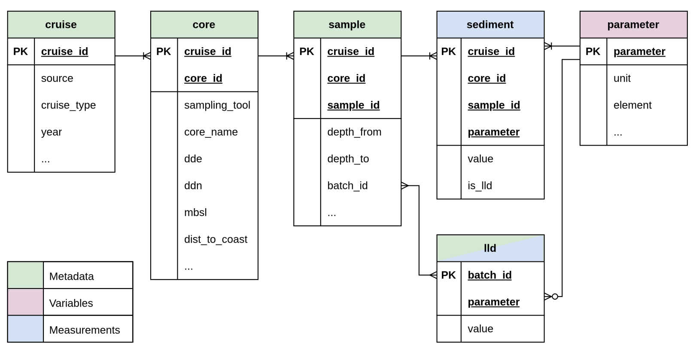

```{css, echo=FALSE}
th {
  white-space: nowrap;
}
```

The page shows the database schema diagram along with table definitions based on the Mareano dataset.

## DB Schema Diagram
The proposed database design shown in the ER (Entity Relationship) diagram below contains six tables including three meta (entity) tables, one variable (look-up or reference) table, one fact (measurement) table, and one mixed meta and measurement table.

The columns with `PK` in the diagram indicate primary keys of the table, which guarantees unique identifications. All tables are connected by one-to-many relationships, except for the LLD table (lld). This table is optional for the parameter table but forms a many-to-many relationship with the sample table.

{.zoomable}


::: {.callout-warning}
A direct SQL join must not be performed between the lld and sample tables due to their many-to-many relationship.
:::

## Cruise Table

The cruise table includes Mareano cruise information and is a parent of the core table.

### Cruise ID

The ID values in the `cruise_id` column are formulated as follows:

> cruise_id: MA-{year}-{cruise_no}

### Table Columns
``` {r}
library(tibble)

cruise_tbl <- tribble(
  ~Name,          ~`Data Type`, ~PK, ~`NA Allowed`, ~Description,
  "cruise_id",    "TEXT",       "✓", "",         "Primary Key. Unique cruise identifier (e.g., MA-2003-209).",
  "source",       "TEXT",       "",  "",         "Data source (Mareano).",
  "cruise_type",  "TEXT",       "",  "",         "Cruise type (Mareano Cruise/Marine Basecamp Cruise).",
  "year",         "INTEGER",    "",  "",         "Year of the cruise.",
  "cruise_no",    "TEXT",       "",  "✓",          "Cruise number.",
  "start",        "TEXT",       "",  "✓",          "Start date of the cruise",
  "end",          "TEXT",       "",  "✓",          "End date of the cruise",
  "start_year",   "INTEGER",    "",  "✓",          "Start year of the cruise",
  "start_month",  "INTEGER",    "",  "✓",          "Start month of the cruise",
  "start_day",    "INTEGER",    "",  "✓",          "Start day of the cruise",
  "end_year",     "INTEGER",    "",  "✓",          "End year of the cruise",
  "end_month",    "INTEGER",    "",  "✓",          "End month of the cruise",
  "end_day",      "INTEGER",    "",  "✓",          "End day of the cruise",
  "area",         "TEXT",       "",  "✓",          "Survey area.",
  "cruise_no2",   "TEXT",       "",  "✓",          "Alternative cruise number."
)

cruise_tbl
```


## Core Table

The core table includes sediment core information and is a parent of the sample table.

### Core ID

The ID values in the `core_id` column are formulated as follows:

> core_id: {station_no}-{sampling_tool}-{core_name}

The {sampling_tool} part is three characters, padded with zeros, while the {core_name} part is two characters (or "00" if not available).

### Table Columns
``` {r}
core_tbl <- tribble(
  ~Name,           ~`Data Type`, ~PK, ~`NA Allowed`, ~Description,
  "cruise_id",     "TEXT",       "✓", "",         "Primary Key. Foreign Key to Cruise table.",
  "core_id",       "TEXT",       "✓", "",         "Primary Key. Unique core identifier (e.g., R0625-BC-000-c1).",
  "station_no",    "TEXT",       "",  "✓",          "Station number.",
  "sampling_tool", "TEXT",       "",  "✓",          "Sampling tool code (BC, MC, GR).",
  "tool_id",       "TEXT",       "",  "✓",          "Specific tool identifier.",
  "core_name",     "TEXT",       "",  "✓",          "Short core name.",
  "ddn",           "REAL",       "",  "",         "Latitude (Decimal Degrees North).",
  "dde",           "REAL",       "",  "",         "Longitude (Decimal Degrees East).",
  "mbsl",          "REAL",       "",  "✓",          "Water depth (Meters Below Sea Level).",
  "dist_to_coast", "INTEGER",    "",  "✓",          "Distance to the nearest Norwegian coastline (km)."
)

core_tbl
```

## Sample Table

The sample table includes specific sediment sample intervals and is a child of the core table.

### Sample ID

The ID values in the `sample_id` column are formulated as follows:

> sample_id: {core_name}-{depth_from}-{depth_to}

All parts are two characters, padded with zeros.

### Table Columns
``` {r}
sample_tbl <- tribble(
  ~Name,        ~`Data Type`, ~PK, ~`NA Allowed`, ~Description,
  "cruise_id",  "TEXT",       "✓", "",         "Primary Key. Foreign Key to Cruise table.",
  "core_id",    "TEXT",       "✓", "",         "Primary Key. Foreign Key to Core table.",
  "sample_id",  "TEXT",       "✓", "",         "Primary Key. Unique sample identifier (e.g., c1_00-02).",
  "depth_from", "INTEGER",    "",  "",         "Top depth of the sample interval (cm).",
  "depth_to",   "INTEGER",    "",  "",         "Bottom depth of the sample interval (cm).",
  "batch_id",   "TEXT",       "",  "✓",          "Laboratory batch identifier.",
  "sample_id2", "TEXT",       "",  "✓",          "Alternative sample identifier."
)

sample_tbl
```

## Parameter Table

The parameter table is a look-up table that contains parameter information for the sediment table.

### Table Columns
``` {r}
parameter_tbl <- tribble(
  ~Name,       ~`Data Type`, ~PK, ~`NA Allowed`, ~Description,
  "parameter", "TEXT",       "✓", "",         "Primary Key. Name of the measured parameter (e.g., Se, Cd_a).",
  "unit",      "TEXT",       "",  "✓",          "Unit of measurement (e.g., mg/kg, %).",
  "element",   "TEXT",       "",  "✓",          "Chemical element (e.g., Selenium, Cadmium).",
  "method1",   "TEXT",       "",  "✓",          "Primary analytical method.",
  "method2",   "TEXT",       "",  "✓",          "Secondary analytical method.",
  "institute", "TEXT",       "",  "✓",          "Institute responsible for the analysis."
)

parameter_tbl
```

## Sediment Table

The sediment table contains measurements for all parameters. 

### Table Columns
``` {r}
sediment_tbl <- tribble(
  ~Name,       ~`Data Type`, ~PK, ~`NA Allowed`, ~Description,
  "cruise_id", "TEXT",       "✓", "",         "Primary Key. Foreign Key to Cruise table.",
  "core_id",   "TEXT",       "✓", "",         "Primary Key. Foreign Key to Core table.",
  "sample_id", "TEXT",       "✓", "",         "Primary Key. Foreign Key to Sample table.",
  "parameter", "TEXT",       "✓", "",         "Primary Key. Foreign Key to Parameter table.",
  "value",     "REAL",       "",  "",         "Measured value.",
  "is_lld",    "INTEGER",    "",  "",         "Flag: 1 if value is Lower Level Detection (LLD), 0 otherwise."
)

sediment_tbl
```

::: {.callout-note}
The is_lld column indicates if the value is LLD (Lower Level of Detection). For example, if the original value is "<5", the value is set to "5", but is_lld is set to 1 (TRUE) instead of the default 0 (FALSE).
:::


## LLD Table

The lld table stores the Lower Level of Detection (LLD) values for measured elements, defined per sample batch.

### Table Columns
``` {r}
lld_tbl <- tribble(
  ~Name,       ~`Data Type`, ~PK, ~`NA Allowed`, ~Description,
  "batch_id",  "TEXT",       "✓", "",         "Primary Key. Batch ID shared with Sample table.",
  "parameter", "TEXT",       "✓", "",         "Primary Key. Foreign Key to Parameter table.",
  "value",     "REAL",       "",  "",         "LLD value.",
  "comment",   "TEXT",       "",  "✓",          "Comments for analytical methods and LLDs."
)

lld_tbl

```
