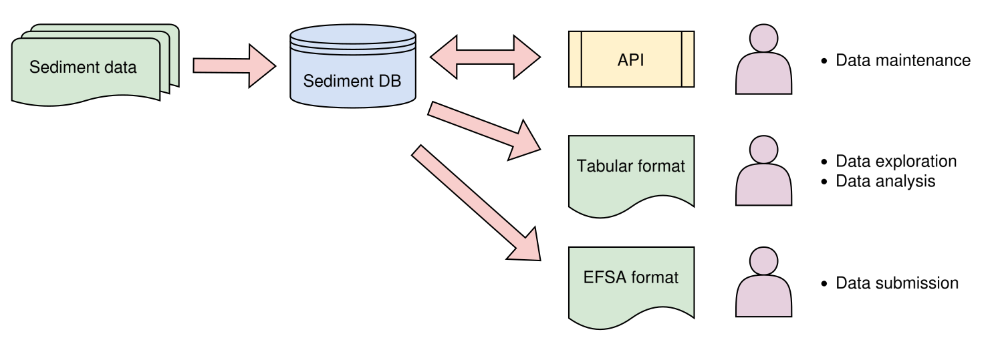

This site presents the initial version of the database design and its potential applications using the publicly available [Mareano](https://www.mareano.no/) dataset.

## Pipeline

The database will be a central component of the project for identifying background sediment cores and samples. Dedicated APIs should be implemented to maintain the data with both read and write access. Exported tabular files will be used for data exploration and the main data analysis. 

As the final goal of the project, the results should be submitted to EFSA by exporting the identified segments in the required EFSA format.

{.zoomable}

## Source Data

- Chemical data page at Mareano: [Chemical Data: NGU and IMR](https://www.mareano.no/en/maps-and-data/chemical-data)

From the downloaded `ods` file, the data from the `INFO` and `INORGANIC` sheets were used to create the pilot database.

### Count of Sediment Cores

The table below summarizes the number of sediment cores collected across 39 parameters for two cruise types (Mareano Cruise and Marine Basecamp Cruise) between 2003 and 2021.

```{r}
library(tidyverse)
library(DT)

# 1. Define the URL for the data file
data_file_url <- "https://github.com/seafood-hazards/pilot-db-with-mareano/releases/download/v0.1.13/pilot_mareano.tsv.gz"
local_data_file_name <- "pilot_mareano.tsv.gz"

# 2. Download Logic
if (!file.exists(local_data_file_name)) {
  options(timeout = 600)
  download.file(data_file_url, destfile = local_data_file_name, mode = "wb")
  message("Database downloaded.")
} else {
  message("Using existing local database.")
}

df_mariano_sediment <- read_tsv(local_data_file_name)
df_counts <- df_mariano_sediment %>%
  distinct(cruise_type, year, core_id, element) %>%
  count(cruise_type, year, element) %>%
  pivot_wider(names_from = element, values_from = n) %>%
  replace(is.na(.), 0) %>%
  mutate(cruise_type = factor(cruise_type)) %>% 
  rename(`Cruise Type` = cruise_type,
         Year = year)

datatable(df_counts, filter = "top", rownames = FALSE, class = "nowrap", options = list(scrollX = TRUE))

```

## Database Design and Creation

After creating the ER (Entity–Relationship) diagram, the tables were implemented in a single SQLite file containing six tables. All required data were extracted from the Mareano tabular file and imported into the corresponding tables.

- See the [DB Schema](./db-schema.qmd) page for details of the database architecture.
- See the [Invalid Data](./invalid-data.qmd) page for issues identified in the Mareano dataset.

## Geospatial Analysis

To facilitate efficient core and sample selection, distances to the nearest Norwegian coastline were calculated for the MAREANO data. In addition, the nearest country and municipality, as well as the sea and ocean names, were identified based on the core locations.

- See the [Distance Calculation](./distance-to-coast.qmd) page for the methods and results of distance calculation to the nearest coastline.
- See the [Location Names](./location-names.qmd) page for the estimation of location names from geographic coordinates.
- See the [Interactive Map](./distance-interactive-map.qmd) page for an interactive visualization of core locations with meta information.

## Data Export

Data can be exported for both exploration and submission.

- See the [Export to Tabular File](./data-export.qmd) page for a description of a single tabular file format (`.tsv.gz`) extracted and merged from all database tables for data exploration.
- See the [EFSA Format](./efsa-format.qmd) page for a description of the EFSA submission file structure.
- See the [EFSA Submission](./efsa-format.qmd) page for the mapping between the database fields and the EFSA submission format.

## Tools

- See the [Pilot DB Viewer](./pilot-db-viewer.qmd) page for a read-only view of the pilot database.
